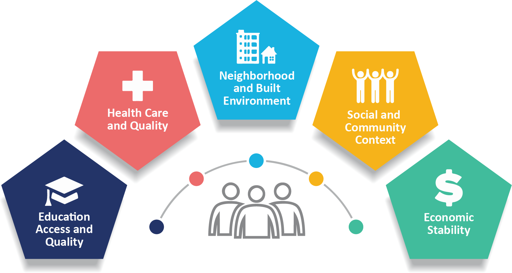
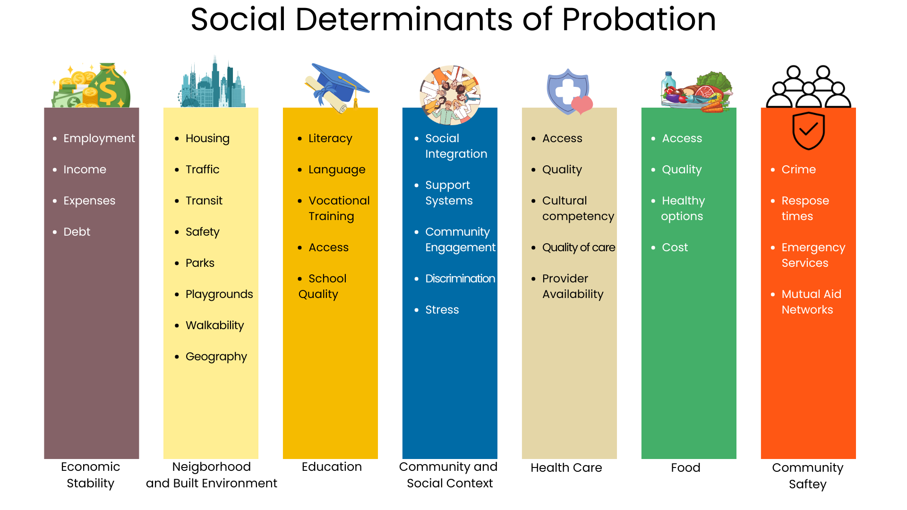
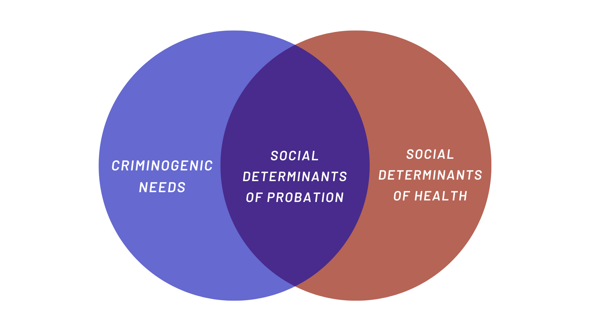

## Who are we {.head_shot}

::::: columns
::: {.column width="50%"}

:::

::: {.column width="50%"}

:::
:::::

## Today's Agenda: Base

:::::: columns
:::: {.column width="70%"}
::: {.incremental .highlight-last}
-   A quick history of the Social Determinants of Probation (SDOP)

-   Hands on with SDOP

-   How Cook County Is Currently Using SDOP

-   Next Steps with SDOP

-   Questions and Answers
:::
::::

::: {.column width="30%"}

:::
::::::

## Slido Poll: Social Determinants of Health

```{=html}
<iframe src='https://wall.sli.do/event/7GzoB4bBE1n1PfhN9Rm4vU/embed/polls/e47531fd-f77b-40d6-98a6-13a12fd47174' height="100%" width="100%" frameBorder="0" style="min-height: 560px;" allow="clipboard-write" title="Slido"></iframe>
```

## A Brief History of the Social Determinants Of Probation

::::::: columns
:::: {.column width="45%"}
::: {.incremental .highlight-last}
-   [Social determinants of health (SDOH) are the nonmedical factors that influence health outcomes.](https://www.cdc.gov/about/priorities/why-is-addressing-sdoh-important.html#:~:text=A%20SDOH%2C%20including%20the%20effects,education%2C%20wealth%2C%20and%20employment.)

-   Cook County Juvenile Court explored collecting this data in 2022

    -   *Don't we collect this information in our screenings and assessments already?*

-   **Most agencies already collect a lot of this data**

-   What matters is how we use it
:::
::::

::: {.column width="10%"}
:::

::: {.column width="45%"}

:::
:::::::

## Categories of SDOP

{fig-align="center"}

## 

::: key-point
### Probation and Court Services are Not Health Care Professionals
:::

## Actuarial Risk Tools

::: {.incremental .highlight-last}
-   Evidence based
-   Valid and reliable
-   Validated and normed on populations
-   Provides a level of predictive validity for reoffending
-   Provides a basis for case planning
:::

## Social Determinants of Probation {.key-point}

### Is a framework to equitably address ways to plan for success, not mitigating failure

## Core Principals of Social Determinants of Probation

1.  Court conditions **alone** do not change behavior
2.  Engaging with youth and families requires a multidisciplanry approach
3.  Case plans should be a youth driven plan for their own success
4.  **Everyone** in the agency has a role to play in planning for our youths' successes
5.  Behavior change is complex and requires patience and resources
6.  We have to be smart with our data and our resources

## Examples of SDOP in Action

::::: columns
::: {.column width="50%"}
##### *Scenario Instructions*

1.  Introduce yourself to your neighbors
2.  Pick a Scenario
3.  Discuss what SDOP factors are being addressed in this brief scenario
4.  Discuss how you can case plan around this issue
5.  Share back on Slido!
:::

::: {.column width="50%"}
{width="55%" fig-align="center"}
:::
:::::

## Scenarios

::::: columns
::: {.column width="75%"}
1.  You are a probation officer in a major metropolitan area. A young person on your caseload has been court ordered to attend therapy, and he lives on the far north side of the city, where he attends school every day. The only agency that will work with him is on the opposite end of the city, and is not on any direct transit line. Neither he nor his family members have access to car. Money for the family is tight.

2.  You have a young person who has been accepted into college and lives with a family member who has a severe addiction is the primary caretaker for another family member. While the family does have assistance from SSI, the guardian's addicition makes it difficult for him to meet his basic needs and complete his necessary paperwork(social security card, birth certificate, etc\_) until he turned 18. He does not have access to a computer. The job market is exceptionaly tight in his neighborhood -- and he has safety concerns traveling on transit.
:::

::: {.column width="25%"}

:::
:::::

## Slido Shareback!

## 

```{=html}
<iframe src='https://wall.sli.do/event/52nhzgTNhRyjU6gf1Qw9GQ/embed/polls/ada49774-9cc9-42a8-b645-d14b1cf8d93a' width='100%' height='100%' style="min-height: 560px;" allow="clipboard-write" title="Slido"></iframe>
```

## SDOP Venn Diagram



## Shareback!

```{=html}
<iframe src='https://wall.sli.do/event/kivBZj9Ut6XSUNcYYwCMv1/embed/polls/03ab845f-a8bc-4328-a24a-112a5548e1f2' height="100%" width="100%" frameBorder="0" style="min-height: 560px;" allow="clipboard-write" title="Slido"></iframe>
```

# Cook County's Implementation of SDOP {.default-override}

## Cook County Municipalities

```{r}
#| label: muni
#| echo: false
#| fig-width: 16
#| fig-height: 10
#| out-width: "100%"
#| out-height: "80vh"
library(leaflet)
library(sf)
library(here)

muni <- read_sf(here("shapefiles", "Municipality.geojson")) %>%
  st_transform(crs = 4326)

leaflet() %>%
  addTiles() %>%
  addPolygons(
    data = muni,
    color = "black",
    weight = 2,
    opacity = 0.4,
    fillOpacity = 0,
    label = muni$MUNICIPALITY
  ) %>%
  setView(lat = 41.85003, lng = -87.65005, zoom = 10)

```

## Chicago Police Districts

```{r}
#| label: chicago
#| echo: false
#| fig-width: 16
#| fig-height: 10
#| out-width: "100%"
#| out-height: "80vh"

library(leaflet)
library(sf)
library(here)
library(dplyr)

chicago <- read_sf(here("shapefiles", "cpd_2024.geojson")) |>
  st_transform(crs = 4326) |>
  mutate(dist_num = as.integer(dist_num)) |>
  arrange(dist_num)

cpd_pal <- colorFactor(palette = "viridis", domain = chicago$dist_num)

leaflet() |>
  addTiles() |>
  addPolygons(
    data = chicago,
    color = "black",
    weight = 2,
    opacity = 0.4,
    fillOpacity = .5,
    fillColor = ~ cpd_pal(chicago$dist_num),
    label = chicago$dist_label
  ) |>
  addLegend(
    position = "bottomleft",
    pal = cpd_pal,
    values = chicago$dist_num,
    title = "Chicago Police Department District Boundaries"
  ) |>
  setView(lat = 41.85003, lng = -87.65005, zoom = 11)

```

## How are we using SDOP

::::: columns
::: {.column width="50%"}
-   Establishing principals
-   Drafting and perfecting our assessments
-   Leveraging our data to guide next steps
-   Partnering with key researchers
:::

::: {.column width="50%"}

:::
:::::

# Economic Stability {.economic-section}

## <i class="fas fa-dollar-sign"></i> Economic Stability {.section-header .economic}

:::::: assessment-questions
### Key Assessment Areas

::: question-card
**Employment Status** - How many adults in your home are employed? - *Scoring: 2+ adults (2 pts), 1 adult (1 pt), None (0 pts)*
:::

::: question-card
**Income Stability** - Has anyone in your home lost a job or source of income? - *Scoring: No (2 pts), Yes (0 pts)*
:::

::: score-info
**Section Maximum: 4 points**
:::
::::::

::: footer
 2025 Dr. Kisha Roberts-Tabb
:::

::: clinical-note
<i class="fas fa-info-circle"></i> **Clinical Significance:** Employment stability strongly predicts probation success rates and reduces recidivism risk.
:::

# Neighborhood & Built Environment {.neighborhood-section}

## <i class="fas fa-home"></i> Neighborhood & Built Environment {.section-header .neighborhood}

:::::::: assessment-questions
### Housing & Environmental Factors

::: question-card
**Housing Stability** - Current housing situation assessment - *Stable (2 pts), Temporary (1 pt), Unstable/None (0 pts)*
:::

::: question-card
**Housing Security** - Concerns about future housing stability - *No concerns (2 pts), Maybe concerned (1 pt), Very concerned (0 pts)*
:::

::: question-card
**Living Conditions** - Environmental hazards checklist - *No problems (2 pts), Multiple issues reduce score*
:::

::: question-card
**Transportation Access** - Impact on appointments and obligations - *No barriers (2 pts), Significant barriers (0 pts)*
:::

::: score-info
**Section Maximum: 8 points**
:::
::::::::

::: footer
 2025 Dr. Kisha Roberts-Tabb
:::

# Education {.education-section}

## <i class="fas fa-graduation-cap"></i> Education {.section-header .education}

:::::::: assessment-questions
### Educational Engagement & Resources

::: question-card
**School Enrollment** - Current educational participation - *Currently enrolled (2 pts), Not enrolled (0 pts)*
:::

::: question-card
**School Safety** - Perception of safety in educational environment - *Always safe (2 pts), Sometimes (1 pt), Never safe (0 pts)*
:::

::: question-card
**Digital Access** - Reliable internet for educational needs - *Reliable access (2 pts), Sometimes (1 pt), No access (0 pts)*
:::

::: question-card
**Enrichment Opportunities** - Access to after-school programs and activities - *Good access (2 pts), Some access (1 pt), No access (0 pts)*
:::

::: score-info
**Section Maximum: 8 points**
:::
::::::::

::: footer
 2025 Dr. Kisha Roberts-Tabb
:::

# Community & Social Context Part- Part 1 {.community-section}

## <i class="fas fa-users"></i> Community & Social Context {.section-header .community}

:::::: assessment-questions
### Social Support & Community Connection

::: question-card
**Social Connections** - Frequency of meaningful social contact - *Often (2 pts), Sometimes (1 pt), Rarely/Never (0 pts)*
:::

::: question-card
**Support Network** - Availability of help from family/friends - *Strong support (2 pts), Some support (1 pt), No support (0 pts)*
:::

::: score-info
**Section Maximum: 4 points**
:::
::::::

::: footer
 2025 Dr. Kisha Roberts-Tabb
:::

# Community & Social Context - Part 2 {.community-section}

## <i class="fas fa-users"></i> Community & Social Context - Part 2 {.section-header .community}

::::::: assessment-questions
### Community Integration & Youth Opportunities

::: question-card
**Community Acceptance** - Feeling valued and accepted in community - *Accepted (2 pts), Sometimes (1 pt), Not accepted (0 pts)*
:::

::: question-card
**Youth Opportunities** - Safe recreational spaces for young people - *Many options (2 pts), Some options (1 pt), No options (0 pts)*
:::

::: question-card
**Social Inclusion** - Frequency of feeling excluded from groups - *Never excluded (2 pts), Sometimes (1 pt), Often excluded (0 pts)*
:::

::: score-info
**Section Maximum: 6 points**
:::
:::::::

::: footer
 2025 Dr. Kisha Roberts-Tabb
:::

# Health Care {.healthcare-section}

## <i class="fas fa-stethoscope"></i> Health Care {.section-header .healthcare}

::::::: assessment-questions
### Healthcare Access & Quality

::: question-card
**Primary Care Access** - Family access to primary healthcare - *Good access (2 pts), No access (0 pts)*
:::

::: question-card
**Emergency Services** - Hospital within 2-mile radius - *Hospital nearby (2 pts), No nearby hospital (0 pts)*
:::

::: question-card
**Mental Health Support** - Difficulties finding mental health resources - *No difficulties (2 pts), Some difficulties (1 pt), Major difficulties (0 pts)*
:::

::: score-info
**Section Maximum: 6 points**
:::
:::::::

::: footer
 2025 Dr. Kisha Roberts-Tabb
:::

::: clinical-note
<i class="fas fa-info-circle"></i> **Clinical Note:** Healthcare access significantly impacts ability to address underlying issues affecting behavior.
:::

# Food Security {.food-section}

## <i class="fas fa-utensils"></i> Food Security {.section-header .food}

:::::: assessment-questions
### Nutritional Stability & Access

::: question-card
**Food Worry - Short Term** - Concern about food running out (past 2 months) - *Never worried (2 pts), Sometimes (1 pt), Often worried (0 pts)*
:::

::: question-card
**Food Insufficiency - Long Term** - Food lasting until next purchase (past 12 months) - *Always sufficient (2 pts), Sometimes insufficient (1 pt), Often insufficient (0 pts)*
:::

::: score-info
**Section Maximum: 4 points**
:::
::::::

::: footer
 2025 Dr. Kisha Roberts-Tabb
:::

::: clinical-note
<i class="fas fa-info-circle"></i> **Research Finding:** Food insecurity correlates with increased stress and behavioral challenges affecting probation compliance.
:::

# Public Safety {.safety-section}

## <i class="fas fa-shield-alt"></i> Public Safety {.section-header .public-safety}

::::::::::: assessment-questions
### Personal Safety & Community Violence

::::::::: columns
::::: {.column width="50%"}
::: question-card
**Personal Safety Indicators** - Physical harm frequency - Verbal abuse frequency\
- Threat frequency - Emotional abuse frequency
:::

::: question-card
**Community Violence** - Loss to gun violence - Neighborhood gun violence exposure
:::
:::::

::::: {.column width="50%"}
::: question-card
**Protective Factors** - Positive community activities - *Many activities (2 pts), Some (1 pt), None (0 pts)*
:::

::: safety-scoring
**Safety Scoring:** - Never/No exposure: 2 points - Rarely: 1 point\
- Sometimes: 1 point - Often/Yes: 0 points
:::
:::::
:::::::::

::: score-info
**Section Maximum: 14 points**
:::
:::::::::::

::: footer
 2025 Dr. Kisha Roberts-Tabb
:::

# Assessment Summary {.summary-slide}

## <i class="fas fa-chart-bar"></i> Scoring Interpretation

::::::: scoring-guide
### Risk Level Categories

::: {.risk-level .low-risk}
**80-100%** - **Low Risk**\
Strong protective factors, minimal intervention needs
:::

::: {.risk-level .moderate-risk}
**60-79%** - **Moderate Risk**\
Some support needs, targeted interventions recommended
:::

::: {.risk-level .high-risk}
**40-59%** - **High Risk**\
Significant needs, comprehensive intervention required
:::

::: {.risk-level .very-high-risk}
**Below 40%** - **Very High Risk**\
Extensive intervention needs, immediate comprehensive support
:::
:::::::

::: total-possible
**Total Possible Score: 54 points**
:::

::: footer
 2025 Dr. Kisha Roberts-Tabb
:::

# What Success Looks Like{.default-override}

## 
```{r}
print(1+1)
```

##

```{r}
#| label: success
#| echo: false
#| fig-width: 16
#| fig-height: 10
#| out-width: "100%"
#| out-height: "80vh"

library(here)
library(leaflet)
library(sf)
library(RColorBrewer)
library(tidyverse)

map_data <- read_rds(here("inputs", "map_data.RDS"))


# Load Data 
data_pal <- colorFactor(palette = "magma", domain = map_data$zip)

# Create a colorblind-safe palette for success rates
success_pal <- colorNumeric(
  palette = "RdYlBu", # Red-Yellow-Blue (colorblind safe)
  domain = c(0, 1),
  reverse = TRUE # Red = low success, Blue = high success
)

# Create the leaflet map
success_map <- leaflet(map_data) |>
  addTiles() |>
  addPolygons(
    fillColor = ~ ifelse(
      is.na(success_rate),
      "#808080",
      success_pal(success_rate)
    ),
    weight = 2,
    opacity = 1,
    color = "white",
    dashArray = "3",
    fillOpacity = 0.7,
    highlight = highlightOptions(
      weight = 4,
      color = "#666",
      dashArray = "",
      fillOpacity = 0.9,
      bringToFront = TRUE
    ),
    
    # Popup information
    popup = ~ paste0(
      "<strong>Zip Code: </strong>",
      zip,
      "<br/>",
      "<strong>Total Cases: </strong>",
      ifelse(is.na(total_cases), "No data", total_cases),
      "<br/>",
      "<strong>Success Rate: </strong>",
      ifelse(
        is.na(success_rate),
        "No data",
        paste0(round(success_rate * 100, 1), "%")
      )
    ),
    
    # Hover labels
    label = ~ paste(
      "Zip:",
      zip,
      "| Success Rate:",
      ifelse(
        is.na(success_rate),
        "No data",
        paste0(round(success_rate * 100, 1), "%")
      )
    ),
    labelOptions = labelOptions(
      style = list("font-weight" = "normal", padding = "3px 8px"),
      textsize = "15px",
      direction = "auto"
    )
  ) |>
  
  # Add legend
  addLegend(
    pal = success_pal,
    values = ~success_rate,
    opacity = 0.7,
    title = "Success Rate",
    position = "bottomright",
    labFormat = labelFormat(suffix = "%", transform = function(x) x * 100),
    na.label = "No Data"
  ) |>
  
  # Set view to Chicago
  setView(lng = -87.65, lat = 41.85, zoom = 11) |>
  
  # Add a title
  addControl(
    html = "<h3>Cook County Probation Success Rates by Zip Code, Jan 2025 to June 2025</h3>",
    position = "topright"
  )

# Display the map
success_map
```

# Next Steps {.default-override}

## Care and Assessment Center: Family Rooom {transition="fade-in slide-out"}


## Care and Assessment Center: Family Room {transition="fade-in slide-out"}


## Care and Assessment Center: Oasis {transition="fade-in slide-out"}


## Care and Assessment Center: Oasis {transition="fade-in slide-out"}


## Thank You

:::::: columns
:::: {.column width="30%"}
::: thank-you
-   The Honorable Timothy Evans
-   The Honorable Donna Cooper
-   Dr. Miquel Lewis
-   Deputy Director Donna Neal
-   Tamar Stockley
-   Allyson Loftus
-   The SDOP Team
-   And You!
:::
::::

::: {.column width="70%"}

:::
::::::
